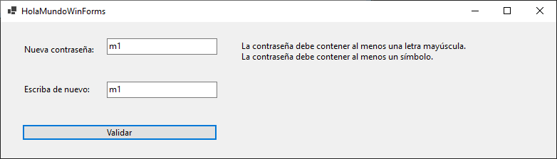
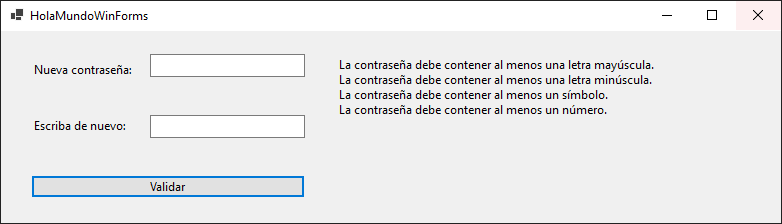
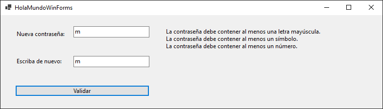
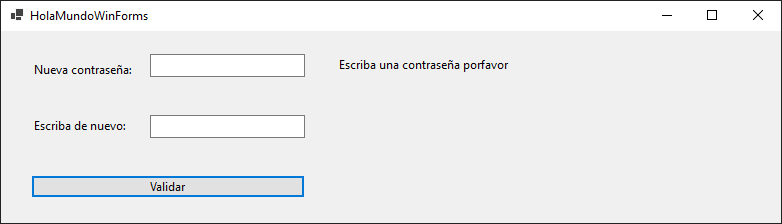
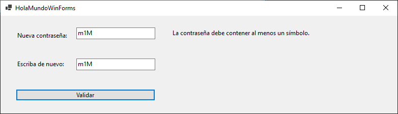
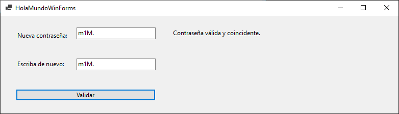
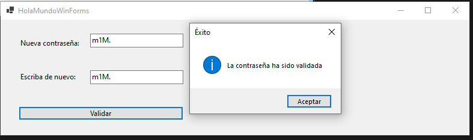

# Validador de Contraseñas en C#

Este proyecto es un ejemplo sencillo en C# que valida que una contraseña cumpla con ciertas validaciones. 

Desarrollado para la materia Ciberinfraestructura 2025B.

---

## Requisitos de la contraseña

La contraseña debe cumplir con las siguientes condiciones:  
- Al menos **una letra mayúscula** (`A-Z`)  
- Al menos **una letra minúscula** (`a-z`)  
- Al menos **un número** (`0-9`)  
- Al menos **un símbolo** (`!@#$%^&*(),.?":;{}|<>`)  
- Debe coincidir con la contraseña ingresada en el segundo campo de verificación  

---

## Instalación

1. Clonar este repositorio o descargar el código fuente.  
2. Abrir el proyecto en **Visual Studio** 2022.  
3. Asegurarse de tener habilitado **.NET Framework (Windows Forms App)**.  

---

## Uso

1. Introducir una contraseña en el primer campo (**textBox1**).  
2. Repetir la contraseña en el segundo campo (**textBox2**).  
3. Hacer clic en el botón de validación.  
4. El programa mostrará un mensaje en **label3** con el resultado de cada validación.
5. Un Alert de éxito aparecerá si la contraseña es válida y coincidente.  

---

## Código principal
```csharp
/*
        * Incorporar a la vista dos campos de texto y un bot�n que validen la estructura de una contraseña, la contraseña deberá exigir:
        * Al menos una letra mayúscula
        * Al menos una letra minúscula
        * Al menos un símbolo
        * Al menos un número
        */

    // Obtener la referencia de textbox1 y textbox2
    string password = textBox1.Text;
    string verificarPassword = textBox2.Text;

    // Mensaje a mostrar al usuario
    string mensaje = "";

    //*** Validaciones ***
    bool valida = true;
    // mayuscula
    bool mayus = Regex.IsMatch(password, @"[A-Z]");
    if (!mayus) {
        mensaje += "La contraseña debe contener al menos una letra mayúscula.\n";
        valida = false;
    }
    // minuscula
    bool minus = Regex.IsMatch(password, @"[a-z]");
    if (!minus) { 
        mensaje += "La contraseña debe contener al menos una letra minúscula.\n";
        valida = false;
    }
    // simbolo
    bool sim = Regex.IsMatch(password, @"[!@#$%^&*(),.?""':;{}|<>]");
    if (!sim) { 
        mensaje += "La contraseña debe contener al menos un símbolo.\n";
        valida = false;
    }
    // numero
    bool num = Regex.IsMatch(password, @"[0-9]");
    if (!num) { 
        mensaje += "La contraseña debe contener al menos un número.\n";
        valida = false;
    }
    
    if (valida)
    {
        // iguales
        if (password == verificarPassword)
        {
            mensaje = "Contraseña válida y coincidente.";
            MessageBox.Show("La contraseña ha sido validada", "Éxito", MessageBoxButtons.OK, MessageBoxIcon.Information);
        }
        else
        {
            mensaje = "Las contraseñas no coinciden.";
        }
    }

    // Mostrar el mensaje al usuario en label3
    label3.Text = mensaje;
```
### Capturas de ejecución







